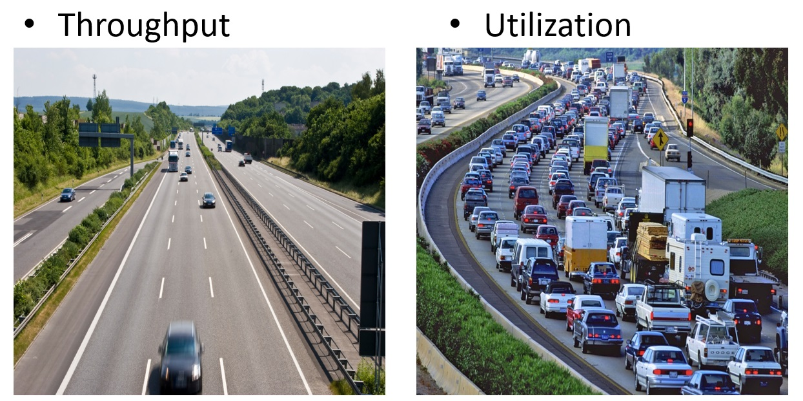

# Thoughts on Kanban and Queueing Theory

I have observed that a lot of people misunderstand Scrum.
Too often they do what has been called "ScrummerFall" or "Cargo-cult Scrum," the most common failing being taking their current process and merely applying the Scrum-ish terms to whatever they're doing now.

I'm seeing the same thing, if not more so, in Kanban, most notably when people claim to be doing Kanban but don't have any WIP limits.
I think it's worse in Kanban because queueing theory is so very counterintuitive.
Proof:  we have traffic jams, lots of them, all the time.
If we intuitively understood queueing theory, that wouldn't be the case.

So, let's start off with a simple quiz:  which of the following are true and which are false?
1. **Shipping more frequently is the goal.**
2. **The more productive a team is, the sooner you can ship.**
3. **High team utilization is a good thing.**
4. **Projects will be more successful if you get them right the first time.**

I'll answer each of these as we go along, but if you want to see the answers now, click [here](Answers.html).

## Kanban Beginnings

The word "Kanban" comes from Japanese, where it means "signal" or "signboard." 
It came from the Toyota Production System, developed in the auto manufacturing industry between 1948 and 1975.

The main idea is this:  the American way to produce car parts (say, hoods) is to set up this huge machine and let it stamp out a bazillion hoods, because once it got going, it was nice and reproducible.
But if you stopped it, you'd have that warm-up time again where it was producing less-than-perfect hoods, until it was warmed up.
So, in the American way, you make a pile of hoods (inventory) and have them on hand for when you make the rest of the car.

At the time, Japanese cars were not of high quality, but Kanban really turned that around.
The idea is exactly the opposite of having a big pile of inventory and instead building just what you need, just when you need it:  just-in-time or JIT.
And they did it with these signal cards.
For example, if you are a worker in a factory making cars and you need a radiator, you go to the radiator station, take the one radiator that's there and replace it with a card for the radiator-maker that says, "Make another radiator."
The same thing happens with all the other parts.

And that allows you to be responsive to the market:  if you need to start building supercharged-turbocharged-EV-hybrid cars all of a sudden, you're in a good position to do so.
Now, doing just-in-time isn't easy. When they first started on this path, it took Toyota engineers and technicians two weeks to set up the press machine to stamp out hoods, but after a while, they got the setup time down to an hour.
That's a great story, because Japanese cars are of extremely high quality now.
But how does this apply to software?

For starters, it answers the first question of our quiz:  "is shipping more frequently the goal?" 

Answer answer is No:  **Responsiveness or shorter cycle time is the goal.**

For example, you could ship a product every week, but still have 3-year-long pipeline: not responsive. 
Alternatively, you should ship a product every week, and have a 2-day-long pipeline:  very responsive.

This is our first queueing theory fact:  cycle time and throughput are separate characteristics of a queue.

## Kanban Overview

For a review (or overview) of Kanban, click [here](KanbanOverview.html).

## Calculating Cycle time

Cycle time is the time from when a card is first pulled from the backlog until it's put into the Final Done pile.

While a card is sitting in the product backlog, it doesn't count against cycle time, because there's been no work done on it, not even design:  each card is just a story and maybe some "done" criteria.

It's like someone starts a stopwatch when the card is pulled from the backlog and stops the watch when putting the card in the final done column.
And in fact, in reality, with a physical Kanban board, it's a good idea to write the date and time on the card when it's pulled from the backlog and again when it's moved to the final done pile.
The difference between these two timestamps is the cycle time for that card.

## Kanban Simulator Exercise

When I was a dev-instructor at *StupendousCorp*, when teaching our Agile/Estimations/Kanban class, I would talk about cycle time and queueing theory, and though people nodded, I could tell from what they said they didn't really get it.
No further explaining was going to help, so I wrote a Kanban simulator to allow them to get a feel for it.

So, here's an exercise. Suppose you have a tiny team with 1 UX person, 1 Dev person and 1 QA person.
And suppose the UX work gets 3 cards done in a day, dev gets 2 cards done per day, and QA does 1 card per day.

Clearly, **throughput is completely determined by the slowest step**, which in this somewhat contrived case is QA.
So I'm setting up some bottlenecks.

Your task is to minimize cycle time, but do so cost-effectively.
One way to shorten cycle time is to hire more people, but that's expensive and you don't have budget. So you can't do that.
You've already hired the best people you can find, so more training or other techniques to increase QA's output are not going to work.

All you can fiddle with is the WIP limits. Go ahead and play with the [Kanban Simulator](KanbanSimulator.html), until you have cycle time (also called "Sojourn time") minimized.

Click [here](Answers2.html) to see if you got it right.

Here's the important bit:  **changing the WIP limits didn't change the throughput** - it's still 0.97 cards per day (it's not exactly 1.00 because of "entrance effects":  it takes a day or two for the first card even to get to the bottleneck at QA).

This answers our second question from the quiz:  "Will a more productive a team ship sooner?"
No, **cycle time is independent of throughput.**

Here's another important bit:  if you see work piling up, it's just sitting there aging, which means cycle times are long. **Long queues imply long cycle times.**

So, UX (or dev) being idle doesn't hurt the throughput.
But it does present an opportunity:  those **idle resources can swarm on the bottleneck, which will increase throughput.**

## T-Shaped Resources

Ideally, we want idle resources to swarm on the bottleneck, but the question always arises:  if I'm a UX person (and cannot code), how can I help devs or QA? Similarly, if UX is the bottleneck, how can devs or QA help with UX work?

The answer is simpler than you might think:  do anything you can; run errands for the bottlenecked workers; get them coffee; pair with them.
After observing them for a while, you might even become a T-shaped resource:  someone with deep expertise in one area but a little bit of expertise in upstream and downstream tasks.
Ideally, you'll become an M-shaped resource with depth both up- and downstream.

Here's a quick story:  I was pairing with a non-coder, Alex, on his tasks when his boss walked by.
She spoke to him for just a minute and then left. 
Alex turned to me and said, "Wow, this pairing really works. Usually, she would have chatted with me for an hour."
Conclusion: even doing very little can result in helping the throughput at the bottleneck.

## Utilization

Our intuition fails us when we think about utilization.
We think, "If someone's idle, he's not helping at all. Therefore, let's keep everyone busy."
And that's completely wrong:

We already talked about how having one or more idle resources who swarm on the bottleneck increases throughput.

This section answers the third question from our quiz:  "Is high team utilization is a good thing?"

No, **high team utilization is a bad thing** because the throughput won't change, but the cycle time will get *really* long.

There's actually a closed-form formula for this, for the case of an [M/M/1 queue](https://en.wikipedia.org/wiki/M/M/1_queue); see the link for the derivation. 
That's a system where arrivals are random ("Markov"), service time is random (the second M), and 1 server.

The important thing to note is that there is a pole at x = 1; that is, the queue length goes to infinity when utilization is 100%.
And that means that cycle time skyrockets, too. 

Notice also how steep the curve is at the far right:  at 95% utilization, the queue size is 19, but at 97.5%, the queue size is 32.333.
A small increase in utilization had a large increase in queue size and cycle time.

We don't want to be anywhere near that. Rather, 50% utilization means a queue size of 1.

To be clear, the worker at the bottleneck is at very high utilization, but the others should be idle and swarming.

## 2nd Order Ignorance and the OODA Loop

4. **Projects will be more successful if you get them right the first time.**  Wrong!

## should I add a second on Little's Law

